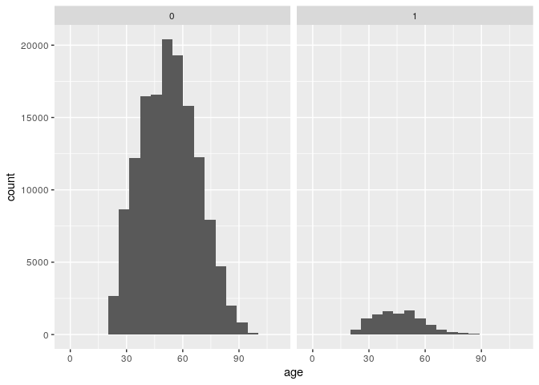
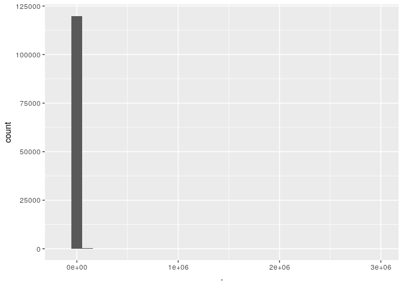
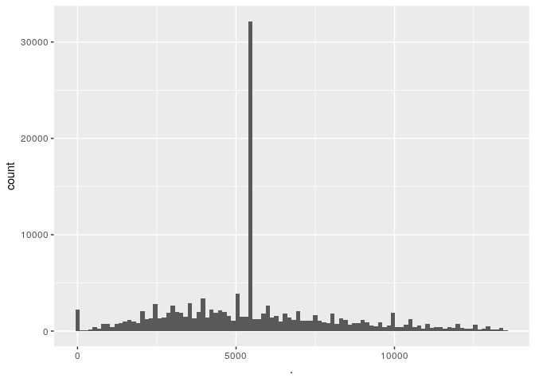
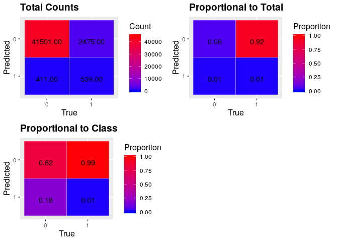
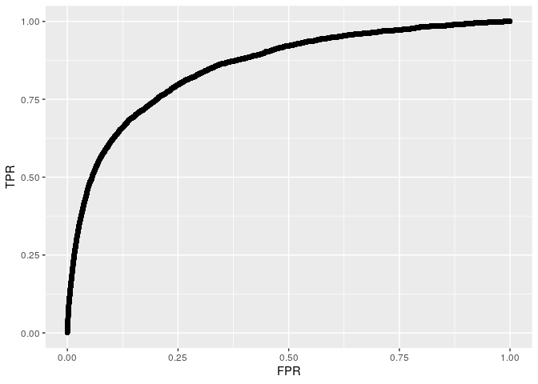
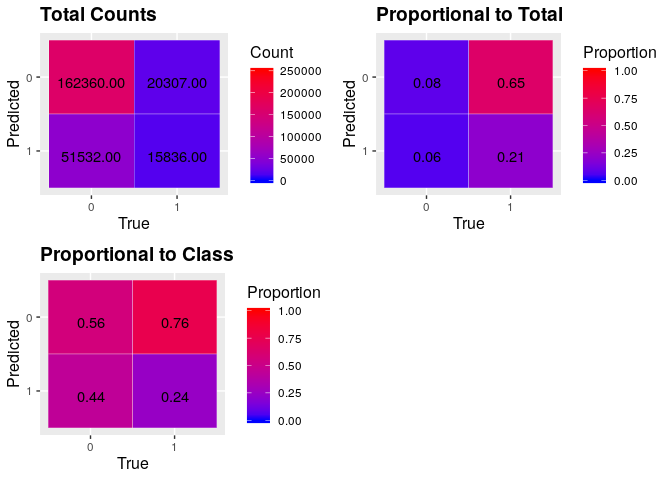

Give Me Credit
================

# Phase 1: Data Exploration / Correction

We will need **dplyr** in order to make sense of our data as well as
make possible modifications. **ggplot2** will be a helpful visualization
tool during this journey. **purrr** will assist us in it useful maping
function for iteration.

``` r
library(dplyr)
library(purrr)
library(tidyr)
library(ggplot2)
library(cowplot)
library(magrittr)
```

``` r
source("../R/utils.R")
source("../R/load_data.R")
```

Now lets load in the data and begin exploring\! The first thing we will
do is take a look at what variables we have to work with and their
types.

``` r
df <- load_all_training_data()

names(df) %>% 
  map(~tibble(Var = .x, Type = typeof(df[[.x]][1]))) %>% 
  bind_rows
```

<div class="kable-table">

| Var                                  | Type    |
| :----------------------------------- | :------ |
| SeriousDlqin2yrs                     | integer |
| RevolvingUtilizationOfUnsecuredLines | double  |
| age                                  | integer |
| NumberOfTime30.59DaysPastDueNotWorse | integer |
| DebtRatio                            | double  |
| MonthlyIncome                        | integer |
| NumberOfOpenCreditLinesAndLoans      | integer |
| NumberOfTimes90DaysLate              | integer |
| NumberRealEstateLoansOrLines         | integer |
| NumberOfTime60.89DaysPastDueNotWorse | integer |
| NumberOfDependents                   | integer |

</div>

I always think it is a good idea to see a few samples of they data you
are working with as well, so here are the first 5
rows.

``` r
df %>% head(n = 5L)
```

<div class="kable-table">

| SeriousDlqin2yrs | RevolvingUtilizationOfUnsecuredLines | age | NumberOfTime30.59DaysPastDueNotWorse | DebtRatio | MonthlyIncome | NumberOfOpenCreditLinesAndLoans | NumberOfTimes90DaysLate | NumberRealEstateLoansOrLines | NumberOfTime60.89DaysPastDueNotWorse | NumberOfDependents |
| ---------------: | -----------------------------------: | --: | -----------------------------------: | --------: | ------------: | ------------------------------: | ----------------------: | ---------------------------: | -----------------------------------: | -----------------: |
|                1 |                            0.7661266 |  45 |                                    2 | 0.8029821 |          9120 |                              13 |                       0 |                            6 |                                    0 |                  2 |
|                0 |                            0.9571510 |  40 |                                    0 | 0.1218762 |          2600 |                               4 |                       0 |                            0 |                                    0 |                  1 |
|                0 |                            0.6581801 |  38 |                                    1 | 0.0851134 |          3042 |                               2 |                       1 |                            0 |                                    0 |                  0 |
|                0 |                            0.2338098 |  30 |                                    0 | 0.0360497 |          3300 |                               5 |                       0 |                            0 |                                    0 |                  0 |
|                0 |                            0.9072394 |  49 |                                    1 | 0.0249257 |         63588 |                               7 |                       0 |                            1 |                                    0 |                  0 |

</div>

Lets take a look at how balanced the labels that we are trying to
predict are in the dataset we are given.

``` r
df %>% 
  summarise(mean(SeriousDlqin2yrs))
```

<div class="kable-table">

| mean(SeriousDlqin2yrs) |
| ---------------------: |
|                0.06684 |

</div>

We see that the mean of this set of binary labels is about .066, showing
that the dataset is mostly filled with people who did not default on
their loans.

## Age vs Serious Deliquency

Plot the distributions of people who defaulted vs age, in general we
should see that younger people default more as credit agencies must give
mortgage to those who are 55 and older

``` r
ggplot(df) +
  geom_histogram(aes(x = age), bins = 20) + 
  facet_wrap(~SeriousDlqin2yrs)
```

<!-- -->

## Debt Ratio

Now lets get a 5 number summary of the debt ratio

``` r
df %>% 
  select(DebtRatio) %>% 
  summary
```

    ##    DebtRatio       
    ##  Min.   :     0.0  
    ##  1st Qu.:     0.2  
    ##  Median :     0.4  
    ##  Mean   :   353.0  
    ##  3rd Qu.:     0.9  
    ##  Max.   :329664.0

As a developing statistician, it is a good thing to note that this is
the same analysis as rounded quanitles by quarters (quartiles)

``` r
df$DebtRatio %>% quantile(probs = seq(0, 1, .25)) %>% round(2)
```

    ##        0%       25%       50%       75%      100% 
    ##      0.00      0.18      0.37      0.87 329664.00

Its concerning that we see that someone owes 300,000 times more than
they own, is this person a single outlier?

``` r
df$DebtRatio %>% quantile(.975)
```

    ##    97.5% 
    ## 3489.025

From this statistic we can see that 2.5% of the dataset owes more than
3,500 times what they own. We need to investigate further to see if
these are outliers or not

``` r
df %>% 
  filter(DebtRatio > 3489.025) %>% 
  select(DebtRatio, MonthlyIncome) %>% 
  summary
```

    ##    DebtRatio      MonthlyIncome  
    ##  Min.   :  3490   Min.   :0.000  
    ##  1st Qu.:  3957   1st Qu.:0.000  
    ##  Median :  4619   Median :0.000  
    ##  Mean   :  5918   Mean   :0.065  
    ##  3rd Qu.:  5790   3rd Qu.:0.000  
    ##  Max.   :329664   Max.   :1.000  
    ##                   NA's   :3565

## Validating Monthly Income Outliers

We see that these outliers either have a monthly income of 0, 1 or NA.
This seems like it could be a data-entry error, lets see if there is any
correlation between Serious Deliquency rate and the monthly income for
these examples

``` r
corr <- df %>% 
  filter(DebtRatio > 3489.025 & !is.na(MonthlyIncome)) %>% 
  select(SeriousDlqin2yrs, MonthlyIncome) %>% 
  mutate(corr = SeriousDlqin2yrs == MonthlyIncome) %>% 
  select(corr) %>% 
  unlist %>% unname
```

``` r
corr %>% 
  table
```

    ## .
    ## FALSE  TRUE 
    ##    21   164

``` r
corr %>% mean
```

    ## [1] 0.8864865

We see that out of the 184 samples that have a valid monthly income, 164
of them (88.6%) have the same value for Seriously Deliquent as for
monthly income, so this must be a data entry error

We see this corrolation, but are these people defaulting on their credit
more than usual?

``` r
df %>% 
  filter(DebtRatio > 3489.025 & !is.na(MonthlyIncome)) %>% 
  select(SeriousDlqin2yrs) %>% 
  summarise(mean = mean(SeriousDlqin2yrs)) 
```

<div class="kable-table">

|      mean |
| --------: |
| 0.0702703 |

</div>

I couldn’t quite understand why/how this subset of candiates owe 3500
times more than they are generating and do not have a higher than usual
default rate. A hypothesis I have include that they have possilby filed
for bankruptcy and are making the payments that they can afford

At any rate it does seem much like an outlier case and can be filtered
out before modelling as these are stand out cases that the model should
probably not be predicting anyway

``` r
df <- df %>% 
  filter(!is.na(MonthlyIncome) && DebtRatio < 3489.025)
```

## Number of 90 Days Late

Now lets take a look at the number of 90 days late variable

``` r
df %>%
  select(NumberOfTimes90DaysLate) %>% 
  unlist %>% 
  table %>%
  as.data.frame %>% 
  set_names(c('Value', 'Frequency'))
```

<div class="kable-table">

| Value | Frequency |
| :---- | --------: |
| 0     |    141662 |
| 1     |      5243 |
| 2     |      1555 |
| 3     |       667 |
| 4     |       291 |
| 5     |       131 |
| 6     |        80 |
| 7     |        38 |
| 8     |        21 |
| 9     |        19 |
| 10    |         8 |
| 11    |         5 |
| 12    |         2 |
| 13    |         4 |
| 14    |         2 |
| 15    |         2 |
| 17    |         1 |
| 96    |         5 |
| 98    |       264 |

</div>

It is interesting that no one is between 17 and 96 times late. Lets take
a lot at these records

``` r
df %>%
  filter(NumberOfTimes90DaysLate > 95) %>% 
  select(SeriousDlqin2yrs, 
         NumberOfTime30.59DaysPastDueNotWorse, 
         NumberOfTime60.89DaysPastDueNotWorse, 
         NumberOfTimes90DaysLate) %>% 
  summary
```

    ##  SeriousDlqin2yrs NumberOfTime30.59DaysPastDueNotWorse
    ##  Min.   :0.0000   Min.   :96.00                       
    ##  1st Qu.:0.0000   1st Qu.:98.00                       
    ##  Median :1.0000   Median :98.00                       
    ##  Mean   :0.5465   Mean   :97.96                       
    ##  3rd Qu.:1.0000   3rd Qu.:98.00                       
    ##  Max.   :1.0000   Max.   :98.00                       
    ##  NumberOfTime60.89DaysPastDueNotWorse NumberOfTimes90DaysLate
    ##  Min.   :96.00                        Min.   :96.00          
    ##  1st Qu.:98.00                        1st Qu.:98.00          
    ##  Median :98.00                        Median :98.00          
    ##  Mean   :97.96                        Mean   :97.96          
    ##  3rd Qu.:98.00                        3rd Qu.:98.00          
    ##  Max.   :98.00                        Max.   :98.00

This sample of subjects has the same exact number of times late for all
three recorded categories, though this might not be an entry error as
they do have a very high default rate at around 55%, compared to the
popululation seen above at 6%

### Winsorization of Late Variables

This might be a good time to implement Winsorization
<https://en.wikipedia.org/wiki/Winsorizing> – The act of transforming
statistics by limiting extreme values to reduce the effect of outliers,
having the same effect as amplitude clipping in signal processing.

To implmenent winsorization here we will let these number of defauling
times be 20s instead of 96 and 98

``` r
mutate_vars <- c("NumberOfTime30.59DaysPastDueNotWorse",
                 "NumberOfTime60.89DaysPastDueNotWorse", 
                 "NumberOfTimes90DaysLate") 


for (var in mutate_vars) {
  df[df[[var]] > 20, var] <- 20 
}
```

``` r
df %>%
  select(SeriousDlqin2yrs, 
         NumberOfTime30.59DaysPastDueNotWorse, 
         NumberOfTime60.89DaysPastDueNotWorse, 
         NumberOfTimes90DaysLate) %>% 
  summary
```

    ##  SeriousDlqin2yrs  NumberOfTime30.59DaysPastDueNotWorse
    ##  Min.   :0.00000   Min.   : 0.0000                     
    ##  1st Qu.:0.00000   1st Qu.: 0.0000                     
    ##  Median :0.00000   Median : 0.0000                     
    ##  Mean   :0.06684   Mean   : 0.2812                     
    ##  3rd Qu.:0.00000   3rd Qu.: 0.0000                     
    ##  Max.   :1.00000   Max.   :20.0000                     
    ##  NumberOfTime60.89DaysPastDueNotWorse NumberOfTimes90DaysLate
    ##  Min.   : 0.0000                      Min.   : 0.0000        
    ##  1st Qu.: 0.0000                      1st Qu.: 0.0000        
    ##  Median : 0.0000                      Median : 0.0000        
    ##  Mean   : 0.1006                      Mean   : 0.1262        
    ##  3rd Qu.: 0.0000                      3rd Qu.: 0.0000        
    ##  Max.   :20.0000                      Max.   :20.0000

## Revolving Utilization of Unsecured Lines

The last variable that we are going to take a look at is revolving
utilization of unsecured lines (RUUL)

RUUL represents the ratio of money owed to credit limit, so it should
really not be above 1

More on Revovling Utilization here
<https://finance.yahoo.com/news/credit-101-revolving-utilization-060108050.html>

``` r
df %>% 
  select(RevolvingUtilizationOfUnsecuredLines) %>% 
  summary
```

    ##  RevolvingUtilizationOfUnsecuredLines
    ##  Min.   :    0.00                    
    ##  1st Qu.:    0.03                    
    ##  Median :    0.15                    
    ##  Mean   :    6.05                    
    ##  3rd Qu.:    0.56                    
    ##  Max.   :50708.00

Possibly more interesting than an individual having a debt ratio greater
than 2500 is an individual having a RUUL of 50,708. Something is most
likely wrong with this entry. Lets first examine different levels of
credit and how much they are defaulting

``` r
x <- df %>% 
  select(RevolvingUtilizationOfUnsecuredLines, 
         SeriousDlqin2yrs) %>% 
  filter(RevolvingUtilizationOfUnsecuredLines >= .9, 
         RevolvingUtilizationOfUnsecuredLines < 4)
```

``` r
x %>% 
  count 
```

<div class="kable-table">

|     n |
| ----: |
| 19805 |

</div>

``` r
x %>% summary
```

    ##  RevolvingUtilizationOfUnsecuredLines SeriousDlqin2yrs
    ##  Min.   :0.9000                       Min.   :0.0000  
    ##  1st Qu.:0.9796                       1st Qu.:0.0000  
    ##  Median :1.0000                       Median :0.0000  
    ##  Mean   :1.0146                       Mean   :0.2254  
    ##  3rd Qu.:1.0000                       3rd Qu.:0.0000  
    ##  Max.   :3.9960                       Max.   :1.0000

These entries have a default rate of ~ 22.5% – almost 1 in 4.

Lets consider 4 to 10 as well.

``` r
x <- df %>% 
  select(RevolvingUtilizationOfUnsecuredLines, 
         SeriousDlqin2yrs) %>% 
  filter(RevolvingUtilizationOfUnsecuredLines > 4, 
         RevolvingUtilizationOfUnsecuredLines <= 10)
```

``` r
x %>% count
```

<div class="kable-table">

|  n |
| -: |
| 23 |

</div>

``` r
x %>% 
  summary %>% 
  as.list %>% 
  as.data.frame %>% 
  t()
```

    ##                     [,1]              
    ## X.Min.....4.075...  "Min.   :4.075  " 
    ## X.1st.Qu..4.416...  "1st Qu.:4.416  " 
    ## X.Median..5.214...  "Median :5.214  " 
    ## X.Mean....5.420...  "Mean   :5.420  " 
    ## X.3rd.Qu..5.689...  "3rd Qu.:5.689  " 
    ## X.Max.....8.852...  "Max.   :8.852  " 
    ## X.Min.....0.0000... "Min.   :0.0000  "
    ## X.1st.Qu..0.0000... "1st Qu.:0.0000  "
    ## X.Median..0.0000... "Median :0.0000  "
    ## X.Mean....0.2609... "Mean   :0.2609  "
    ## X.3rd.Qu..0.5000... "3rd Qu.:0.5000  "
    ## X.Max.....1.0000... "Max.   :1.0000  "

There are only 23 records in this region, but they are defaulting at a
very high rate, with this in mind lets take a look at records with an
even higher RUUL

``` r
x <- df %>% 
  select(RevolvingUtilizationOfUnsecuredLines, 
         SeriousDlqin2yrs) %>% 
  filter(RevolvingUtilizationOfUnsecuredLines > 10) 
```

``` r
x %>% count
```

<div class="kable-table">

|   n |
| --: |
| 241 |

</div>

``` r
x %>% summary
```

    ##  RevolvingUtilizationOfUnsecuredLines SeriousDlqin2yrs 
    ##  Min.   :   11.39                     Min.   :0.00000  
    ##  1st Qu.:  941.00                     1st Qu.:0.00000  
    ##  Median : 2012.00                     Median :0.00000  
    ##  Mean   : 3564.02                     Mean   :0.07054  
    ##  3rd Qu.: 4116.00                     3rd Qu.:0.00000  
    ##  Max.   :50708.00                     Max.   :1.00000

But how can people have more debt than their credit limit? It could be
from individuals maxxing out a credit card and having it closed – or if
they do not make an income and have a debt – their account income might
be set to $0.01 instead of 0 as to not lead to a NaN value.

After investigating further we see that these 241 people are not
defaulting at any higher of a rate than the standard population. Again
this is a situation that we might want to filter out before
classification through an svm as this might throw off our classifier.

``` r
df <- df %>% 
  filter(RevolvingUtilizationOfUnsecuredLines < 10)
```

Finally lets take a look at using regression to fill in our missing
values for Monthly Income as this seems to be an important feature that
we would want to have for every sample

``` r
clean_df <- df %>% 
  drop_na

model <- lm(MonthlyIncome~., clean_df)

model$residuals %>% range
```

    ## [1]  -69173.87 3000170.67

``` r
model$residuals %>% 
  as.data.frame() %>% 
  ggplot + 
  geom_histogram(aes(x = .))
```

<!-- -->

``` r
model$coefficients
```

    ##                          (Intercept)                     SeriousDlqin2yrs 
    ##                          2493.156834                          -763.982390 
    ## RevolvingUtilizationOfUnsecuredLines                                  age 
    ##                          -528.866878                            30.627968 
    ## NumberOfTime30.59DaysPastDueNotWorse                            DebtRatio 
    ##                           -36.968717                            -1.068722 
    ##      NumberOfOpenCreditLinesAndLoans              NumberOfTimes90DaysLate 
    ##                           108.705812                           -24.404721 
    ##         NumberRealEstateLoansOrLines NumberOfTime60.89DaysPastDueNotWorse 
    ##                          1236.305083                            18.771040 
    ##                   NumberOfDependents 
    ##                           724.677073

The **summary** function is overridden for model types so we can see the
r squared there.

``` r
model %>% summary
```

    ## 
    ## Call:
    ## lm(formula = MonthlyIncome ~ ., data = clean_df)
    ## 
    ## Residuals:
    ##     Min      1Q  Median      3Q     Max 
    ##  -69174   -2759    -998    1288 3000171 
    ## 
    ## Coefficients:
    ##                                        Estimate Std. Error t value
    ## (Intercept)                          2493.15683  187.42723  13.302
    ## SeriousDlqin2yrs                     -763.98239  172.39455  -4.432
    ## RevolvingUtilizationOfUnsecuredLines -528.86688  123.86129  -4.270
    ## age                                    30.62797    3.04837  10.047
    ## NumberOfTime30.59DaysPastDueNotWorse  -36.96872   61.91654  -0.597
    ## DebtRatio                              -1.06872    0.09672 -11.050
    ## NumberOfOpenCreditLinesAndLoans       108.70581    9.03886  12.027
    ## NumberOfTimes90DaysLate               -24.40472   85.09222  -0.287
    ## NumberRealEstateLoansOrLines         1236.30508   39.79621  31.066
    ## NumberOfTime60.89DaysPastDueNotWorse   18.77104  100.45108   0.187
    ## NumberOfDependents                    724.67707   36.94376  19.616
    ##                                      Pr(>|t|)    
    ## (Intercept)                           < 2e-16 ***
    ## SeriousDlqin2yrs                     9.36e-06 ***
    ## RevolvingUtilizationOfUnsecuredLines 1.96e-05 ***
    ## age                                   < 2e-16 ***
    ## NumberOfTime30.59DaysPastDueNotWorse    0.550    
    ## DebtRatio                             < 2e-16 ***
    ## NumberOfOpenCreditLinesAndLoans       < 2e-16 ***
    ## NumberOfTimes90DaysLate                 0.774    
    ## NumberRealEstateLoansOrLines          < 2e-16 ***
    ## NumberOfTime60.89DaysPastDueNotWorse    0.852    
    ## NumberOfDependents                    < 2e-16 ***
    ## ---
    ## Signif. codes:  0 '***' 0.001 '**' 0.01 '*' 0.05 '.' 0.1 ' ' 1
    ## 
    ## Residual standard error: 14230 on 120085 degrees of freedom
    ## Multiple R-squared:  0.02235,    Adjusted R-squared:  0.02227 
    ## F-statistic: 274.5 on 10 and 120085 DF,  p-value: < 2.2e-16

Our adjusted R squared value (penalizes for model size) is .022 – only
slightly better than guessing the mean

We see that we have a very significant F-statistic, though this does not
automatically mean that our model is amazing – Just because we have
statistical significance does not mean that we have practical
significance

In short, this is bad so we will replace missing values with median
value (robust to
outliers)

``` r
median_monthly_income <- df$MonthlyIncome[!is.na(df$MonthlyIncome)] %>% median
df$MonthlyIncome[is.na(df$MonthlyIncome)] <- median_monthly_income
x <- df$MonthlyIncome %>% .[. < quantile(., .95)]
```

``` r
x %>% 
  as.data.frame %>% 
  ggplot +
  geom_histogram(aes(x = .), bins = 100)
```

<!-- -->

30k entries did not have a monthly income so thats why so many people
have the median value that we calculated

# Phase 2: Modelling

Now that we have some understanding of our data and have filtered out
cases that are easily discernable or outliers that will negatively
affect our model, we are ready to begin exploring the most effective
class of model for our dataset

Due to the amount of outliers in our data, it would be best to start
with a classifier robust to these, such as the **Random Forest** model.
A random forest is simplistic model, though has proven itself to be very
effective in many fields.

## Random Forest

We will use the **randomForest** package in R for this model.

``` r
library(randomForest)
```

I have wrote a few functions to help with loading the data with proper
filtering, as well as to help with model assessment.

``` r
load_model_data()

train$SeriousDlqin2yrs %<>% as.factor()
xtest <- test %>% select(-SeriousDlqin2yrs)
ytest <- test$SeriousDlqin2yrs %>% as.factor
```

Note that we must translate the target variable to a factor to use a
classification tree as opposed to a regression tree in the randomForest
package. Once our model is trained we can save it into rds format so
that it is reloadable.

``` r
model_file <- "../models/rf_model_2500.rds"
if (!exists('rf_model') && file.exists(model_file)) {
  rf_model <- readRDS(file = model_file)
} else {
  # train rf model  
}

if (!exists('raw_preds') && !file.exists('predictions.rds')) {
  raw_preds <- predict(rf_model, test %>% select(-SeriousDlqin2yrs), type = 'prob')
  saveRDS(object = raw_preds, file = 'predictions.rds')
} else if (!exists('raw_preds')) {
  raw_preds <- readRDS('predictions.rds')
}

preds <- raw_preds[,2] %>% unname

confusion_matrix(test$SeriousDlqin2yrs, preds, clf_thresh = .5)
```

<!-- -->

``` r
roc <- simple_roc(test$SeriousDlqin2yrs, preds)
```

<!-- -->

``` r
clf_thresh <- roc %>% select_threshold(FPR = .25)
```

    ## range within thresh:  0.0424 0.0476 
    ## median threshold:  0.0448

``` r
confusion_matrix(test, preds, clf_thresh = clf_thresh)
```

<!-- -->

# Future work

  - Class imbalanced sampling methods
  - **SVM**
  - **Naieve Bayes**
  - **Neural Network**

<!-- ## SVM  -->

<!-- ```{r} -->

<!-- library(e1071) -->

<!-- train -->

<!-- model <- svm(x = df %>% select(-SeriousDlqin2yrs),  -->

<!--              y = df$SeriousDlqin2yrs) -->

<!-- ``` -->

<!-- ## Naieve Bayes -->

<!-- model here -->

<!-- ## neural net  -->

<!-- neural net here  -->
